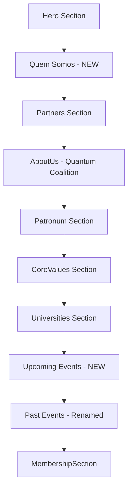

# LACQF Website Redesign Plan

## Overview
This document outlines the planned changes to the LACQF website based on user feedback.

## Current Issues Identified

### 1. Content Structure (Prioritization)
- **Problem**: Partners section appears before explaining what LACQF is
- **Problem**: Quantum Coalition URL is displayed as plain text, not clickable
- **Current Order**: Hero → Partners → AboutUs → Patronum → CoreValues → Universities → Events → MembershipSection

### 2. Event Management
- **Problem**: Events section shows 2024 events but subtitle says "acompanhe" (follow), creating confusion
- **Problem**: No distinction between upcoming and past events

### 3. Links and UX
- **Problem**: Quantum Coalition link is not clickable
- **Problem**: URL displayed as plain text instead of styled button/link

---

## Proposed Changes

### 1. New Page Structure



### 2. Section Details

#### New: "Quem Somos" (Who We Are) Section
- **Position**: Immediately after Hero
- **Content**: Clear explanation of LACQF identity, mission, and purpose
- **Key Elements**:
  - League name and purpose
  - Brief mission statement
  - Key statistics (members, projects, workshops)
  - Call to action

#### Updated: AboutUs Section
- **Focus**: Quantum Coalition membership
- **Changes**:
  - Convert plain text URL to styled "Saiba mais" button
  - Emphasize partnership with Quantum Coalition
  - Link to https://www.quantumcoalition.io/

#### New: "Próximos Eventos" (Upcoming Events) Section
- **Position**: Before Past Events
- **Content**: 1-2 placeholder future events
- **Design**: Similar to current Events component but with future dates

#### Renamed: "Eventos Já Realizados" (Past Events) Section
- **Changes**:
  - Update title from "Eventos Acadêmicos" to "Eventos Já Realizados"
  - Update subtitle to clarify these are past events
  - Keep existing 2024 events

---

## Implementation Files

### New Components
- `src/ui/components/WhoWeAre.jsx` - New "Quem Somos" section
- `src/ui/components/UpcomingEvents.jsx` - New upcoming events section

### Modified Components
- `src/app/page.js` - Reorder sections, add new components
- `src/ui/components/AboutUs.jsx` - Add clickable Quantum Coalition link
- `src/ui/components/Events.jsx` - Rename to "Eventos Já Realizados"

### Translation Files
- `src/locales/pt-BR.json` - Add Portuguese translations
- `src/locales/en.json` - Add English translations
- `src/locales/es.json` - Add Spanish translations

---

## Translation Keys to Add

### WhoWeAre Section
```json
{
  "whoWeAreTitle": "Quem Somos",
  "whoWeAreDescription": "...",
  "whoWeAreMission": "...",
  "whoWeAreCTA": "Conheça mais"
}
```

### Upcoming Events Section
```json
{
  "upcomingEventsTitle": "Próximos Eventos",
  "upcomingEventsSubtitle": "...",
  "noUpcomingEvents": "Em breve, novos eventos serão anunciados."
}
```

### Updated Events Section
```json
{
  "pastEventsTitle": "Eventos Já Realizados",
  "pastEventsSubtitle": "Confira os eventos que já realizamos em 2024."
}
```

### Quantum Coalition Link
```json
{
  "quantumCoalitionLink": "Saiba mais"
}
```

---

## Design Considerations

### Quantum Coalition Button
- Style: Gradient button matching site theme
- Text: "Saiba mais" (Learn more)
- Icon: External link icon
- Hover effects: Shadow and scale

### Event Sections
- Upcoming Events: Highlighted/prominent design
- Past Events: Subtle design, possibly with counter badge

---

## Navigation Updates

The navigation sections array in `page.js` will be updated to:
```javascript
const sections = useMemo(() => [
  { id: 'whoWeAre', title: 'Quem Somos' },
  { id: 'about', title: 'Quantum Coalition' },
  { id: 'universities', title: 'Universities' },
  { id: 'upcomingEvents', title: 'Próximos Eventos' },
  { id: 'events', title: 'Eventos Realizados' },
  { id: 'membership', title: 'Junte-se' },
  { id: 'sponsors', title: 'Parceiros' },
], []);
```
